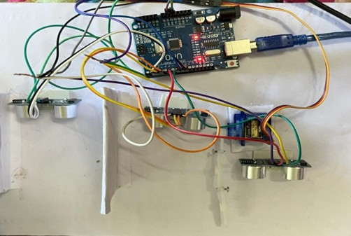
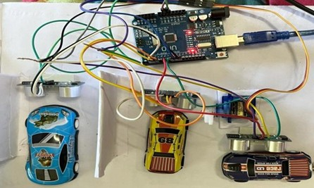

# Circuit Setup

This folder contains images of the complete hardware and circuit implementation of the *Automatic Gate Control for Smart Parking System*.

---

## Hardware Setup Without Cars

- Shows the initial setup of the parking system
- Parking slots are empty and available
- Ultrasonic sensors monitor slot status continuously

---

## Hardware Setup With Cars

- Demonstrates vehicle detection in parking slots
- Occupied slots are identified using ultrasonic sensors
- The system updates parking availability in real time

---

## Features Demonstrated

- Vehicle detection using ultrasonic sensors
- Automated gate control using servo motor
- Real-time parking slot monitoring
- Smart slot allocation logic using Min Heap
- FIFO vehicle handling using Circular Queue

---
