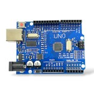
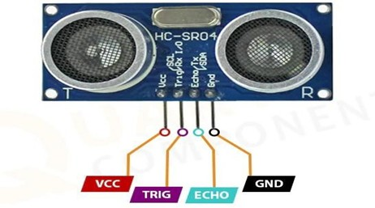
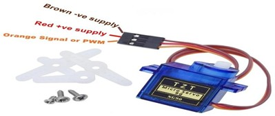

# Components Used

This folder contains images of the hardware components used in the *Automatic Gate Control for Smart Parking System*.

---

## Components

### Arduino UNO Board

- Main microcontroller of the project
- Controls sensors and servo motor
- Executes parking allocation logic using Circular Queue and Min Heap

---

### HC-SR04 Ultrasonic Sensor

- Detects vehicle presence using distance measurement
- Used at the entry gate and parking slots
- Helps determine slot availability

---

### Servo Motor (SG90)

- Simulates the automated parking gate
- Rotates to open and close the gate automatically
- Controlled by the Arduino UNO

---
