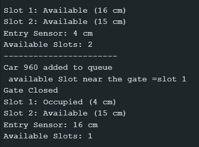
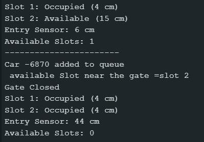
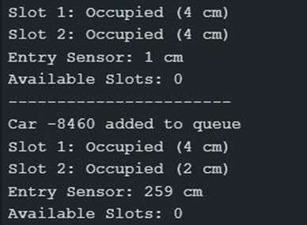

# Serial Monitor Output

This folder contains screenshots of the Arduino Serial Monitor displaying the real-time status of the smart parking system.

The Serial Monitor helps visualize vehicle detection, parking slot availability, and gate control operations.

---

## Both Slots Available

- Indicates that all parking slots are free
- Vehicles can enter and occupy available slots
- The system is ready to allocate parking spaces

---

## One Slot Occupied and One Slot Available

- Shows partial occupancy of the parking area
- One parking slot is occupied
- One parking slot remains available for incoming vehicles

---

## Both Slots Occupied

- Indicates that all parking slots are occupied
- No additional vehicles are allowed to enter
- The gate remains closed until a slot becomes free

---

## Features Displayed in Serial Monitor

- Real-time vehicle detection
- Parking slot availability status
- Entry gate operation updates
- Smart parking allocation results
- Occupancy monitoring using ultrasonic sensors

---
